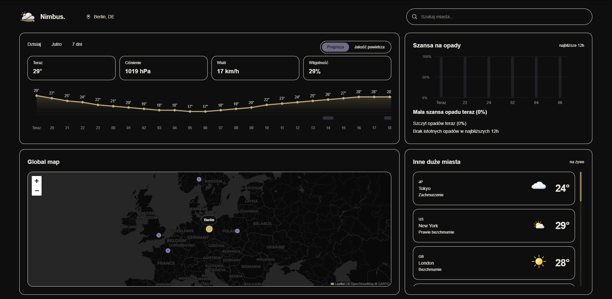
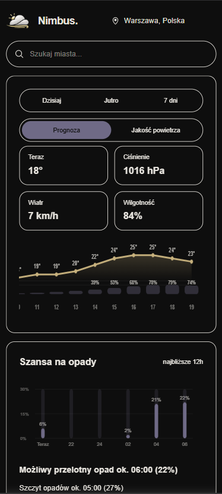
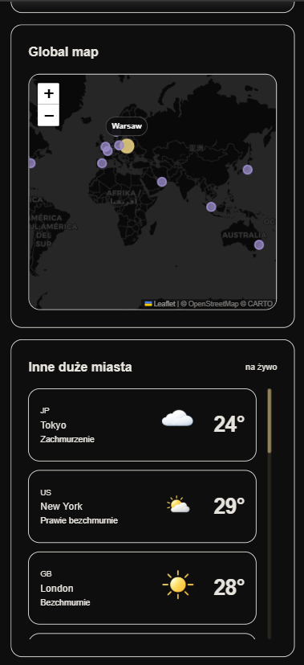
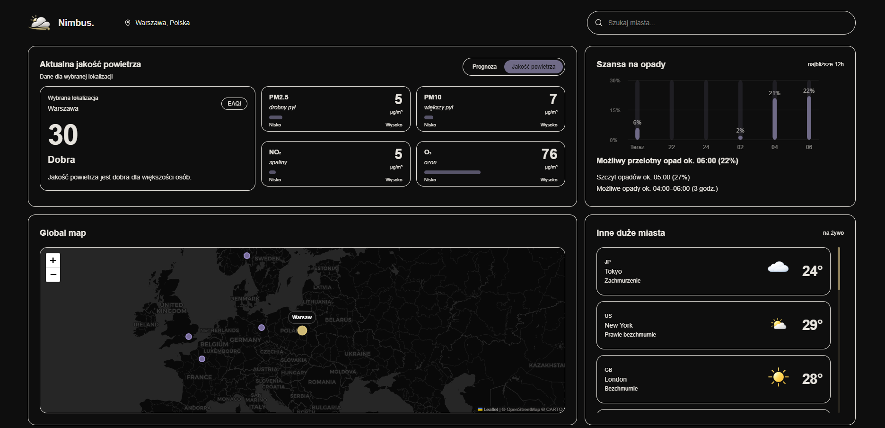

# Nimbus

**Nimbus** is a responsive weather application built with Next.js, TypeScript and Tailwind CSS. The project displays current weather, hourly forecast, tomorrow and 7-day forecasts, air quality, chance of rain and an interactive map with major cities.

The application uses external Open-Meteo APIs and is deployed as a static website hosted on GitHub Pages.

## Demo

View the live site here:  
**[https://puudelkoo.github.io/nimbus-weather-app/](https://puudelkoo.github.io/nimbus-weather-app/)**

## Preview

<p align="center">
  
</p>

<p align="center">
  <b>Desktop view</b><br />
  Dashboard with current weather, hourly forecast, map and a list of major cities.
</p>

<p align="center">
  
  &nbsp;&nbsp;&nbsp;
  
</p>

<p align="center">
  <b>Mobile view</b><br />
  Responsive layout with forecast, map and a list of major cities.
</p>

<p align="center">
  
</p>

<p align="center">
  <b>Air quality view</b><br />
  Panel with the European Air Quality Index and PM2.5, PM10, NO₂ and O₃ values.
</p>

## Tech stack

<p>
  
</p>

- Next.js
- React
- TypeScript
- Tailwind CSS
- Leaflet / React Leaflet
- Open-Meteo API
- GitHub Pages
- GitHub Actions

## Features

- city search,
- current weather for the selected location,
- hourly forecast with temperature and precipitation chart,
- tomorrow forecast divided into parts of the day,
- 7-day forecast,
- current air quality,
- PM2.5, PM10, NO₂ and O₃ indicators,
- chance of rain chart for the next 12 hours,
- interactive map with markers for major cities,
- list of major cities with current weather,
- responsive interface for desktop, tablet and mobile devices,
- dark, minimalist UI.

## Main application sections

### Forecast

The forecast section displays current weather data such as temperature, pressure, wind speed and humidity. The user can switch between today's forecast, tomorrow's forecast and the 7-day forecast.

### Air quality

The air quality view displays the current European Air Quality Index and selected pollutant values:

- PM2.5,
- PM10,
- NO₂,
- O₃.

### Chance of rain

This panel shows the probability of precipitation over the next 12 hours, the highest chance of rain and the estimated time window for possible rainfall.

### Map

The interactive map allows the user to select one of the major cities. After clicking a marker, the application updates the weather data for the selected location.

### Other major cities

The list of major cities displays the current temperature, a short weather description and a weather icon. Clicking a city changes the active location across the entire application.

## Running locally

Clone the repository:

```bash
git clone https://github.com/puudelkoo/nimbus-weather-app.git
```
Go to the project folder:

```bash
cd nimbus-weather-app
```

Install dependencies:

```bash
npm install
```

Run the project locally:

```bash
npm run dev
```

Build the production version:

```bash
npm run build
```

## Deployment

The project is hosted on **GitHub Pages**.  
Deployment is handled automatically with **GitHub Actions** after each push to the `main` branch.

The application uses a static Next.js export, so it can be hosted as a regular static website.

## Project status

The project is a working version of a weather application with a responsive interface, interactive map, air quality data and weather forecasts. Future improvements may include saving favorite cities, historical charts, animations, tests or PWA support.
